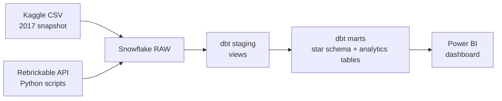
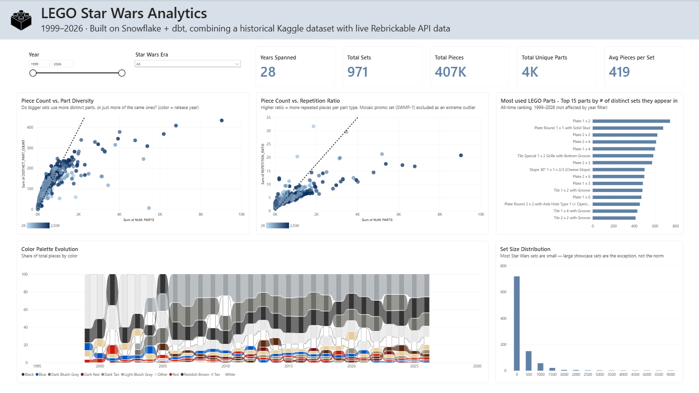

# LEGO Star Wars Analytics

A personal data engineering project analyzing 27 years (1999-2026) of LEGO Star Wars sets, built to learn Snowflake and its surrounding modern data stack (dbt, Git, key-pair authentication) through a real, end-to-end pipeline rather than isolated tutorials.

Built with Snowflake, dbt, Python, and Power BI.

---

## Why this project

I wanted to learn Snowflake for a Data/Business Analyst job search. Instead of working through disconnected tutorials, I built a complete pipeline around something I actually enjoy: LEGO Star Wars. It uses a public 2017 Kaggle dataset combined with live data from the Rebrickable API to bring the analysis up to the present day.

The result touches most of the modern analytics stack a job posting actually asks for: a cloud data warehouse, SQL and Python-based ingestion, dbt for transformation and modeling, Git for version control, and Power BI for visualization. The data quality problems in it are real, not smoothed over from a clean textbook dataset.

---

## Architecture



**Two sources, reconciled deliberately:**
- **Kaggle's LEGO Database** (2017 snapshot): the historical backbone
- **Rebrickable's live API**: a Python-based top-up covering 2018-2026, plus supplementary lookups for parts, colors and categories introduced since 2017

**Three layers, dbt-managed:**
- `RAW`: data landed exactly as sourced, no transformation
- `STAGING`: cleaned, scoped, and unioned across sources (views)
- `MARTS`: a proper star schema plus purpose-built analytical tables (physical tables)

---

## Tech stack

| Layer | Tool |
|---|---|
| Warehouse | Snowflake |
| Transformation | dbt Core (dbt-snowflake adapter) |
| Ingestion | Python (`requests`, `python-dotenv`) |
| Version control | Git / GitHub |
| Authentication | RSA key-pair (migrated from password auth mid-project) |
| Visualization | Power BI |

---

## Key data engineering challenges (and how they were solved)

This project wasn't built on a clean, pre-packaged dataset on purpose. Several real reconciliation problems came up, and each one was traced to a specific root cause instead of just patched over.

**1. The theme taxonomy changed between 2017 and today.**
The Kaggle snapshot organizes Star Wars into 30 theme IDs across three levels of nesting (root theme, sub-themes, sub-sub-themes). The live Rebrickable API has consolidated this down to just 2 theme IDs. A recursive CTE walks the historical hierarchy correctly. The two sources are scoped independently using their own correct ID schemes and combined afterward on shared fields (`set_num`, `year`), never joined on theme ID across sources.

**2. New parts, colors, and categories didn't exist in the 2017 snapshot.**
Nine years of new LEGO releases introduced parts, colors, and part categories the historical dataset has no record of. Rather than let joins silently drop this data, each gap was identified through left-join orphan checks, and small targeted API pulls closed them: 974 parts, 9 colors, and 14 part categories added as top-up tables.

**3. A batch fetch left 3 parts unresolved, and that got investigated rather than ignored.**
Three part numbers remained unmatched after the top-up. They were traced to `color_id = 9999`, Rebrickable's convention for non-standard promotional inventory items. That pattern actually shows up across 147 rows total, not just those 3, which was an initial undercount caught and corrected during validation. These rows are documented and excluded from part-composition analysis, since they aren't real buildable pieces.

**4. 83 sets have no inventory data, for two different reasons.**
82 of these are co-packs, bundles, and promotional "Super Packs" that combine other existing sets. They structurally have no independent parts inventory of their own. One (set 75160, "U-wing") is a genuine gap in Rebrickable's own source data. Both categories were identified and kept distinct rather than lumped together.

**5. Password authentication was deprecated mid-project.**
Partway through, Snowflake flagged the account for using single-factor password authentication, part of an industry-wide deprecation that was actively rolling out at the time. The dbt connection was migrated to RSA key-pair authentication, a stronger and more current practice.

---

## Data model

**Star schema (`MARTS` schema):**
- `dim_sets` (1,054 rows), `dim_colors` (144 rows), `dim_parts` (26,967 rows)
- `fact_inventory_parts` (107,962 rows), grain: one row per part/color/set combination

**Analytical tables, purpose-built for the dashboard:**
- `mart_set_analytics` (971 standalone sets): part diversity, color concentration, repetition ratio, and size compared to that year's average, per set
- `mart_color_trends_by_year`: color usage share by year (top 10 colors plus "Other")
- `mart_part_reuse_ranking`: parts ranked by how many distinct sets use them

Note the 971 instead of 1,054: the 83 non-standalone or incomplete sets discussed above are excluded from the analytical layer, since they don't have meaningful part-composition data.

---

## Dashboard

A single-page Power BI dashboard, built to be visually cohesive rather than a grid of default charts:

- **KPI row**: total sets, total pieces, unique part types, average pieces per set, years spanned
- **Color Palette Evolution**: a ribbon chart of color composition by year, custom-colored to match real LEGO hex values instead of a default palette
- **Piece Count vs. Part Diversity**: a scatter plot (one dot per set) colored on a continuous gradient by release year
- **Piece Count vs. Repetition Ratio**: a second scatter, with one extreme outlier (a mosaic-style promotional set built from just 6 distinct parts) investigated and excluded
- **Set Size Distribution**: a histogram showing that most sets are small and large showcase sets are the exception
- **Most-Reused LEGO Parts**: a ranking of the most universally reused pieces across the whole collection
- **Interactive year/era filtering**: through a purpose-built date dimension table, kept intentionally separate from the analytical marts so it doesn't reintroduce join ambiguity into pre-aggregated tables



---

## Repository structure

```
├── snowflake_setup/       # Numbered, version-controlled infrastructure SQL
├── data_ingestion/        # Python scripts for Rebrickable API extraction
├── exploration/           # Data profiling and validation queries
├── lego_analytics/        # dbt project (staging + marts models)
└── powerbi/               # Power BI dashboard file
```

Raw data files and credentials are intentionally excluded from version control (see `.gitignore`). The pipeline is fully reproducible from the scripts and SQL in this repo.

---

## What I'd do differently, or next

- Add minifigure-level data (dropped from scope to keep the project to a focused two-weekend build)
- Rebuild `mart_part_reuse_ranking` at set-level grain so it can respond to the year filter like the rest of the dashboard, instead of remaining an intentionally static all-time ranking
- Explore dbt tests (`not_null`, `unique`, `relationships`) to formalize the validation checks that are currently run manually
